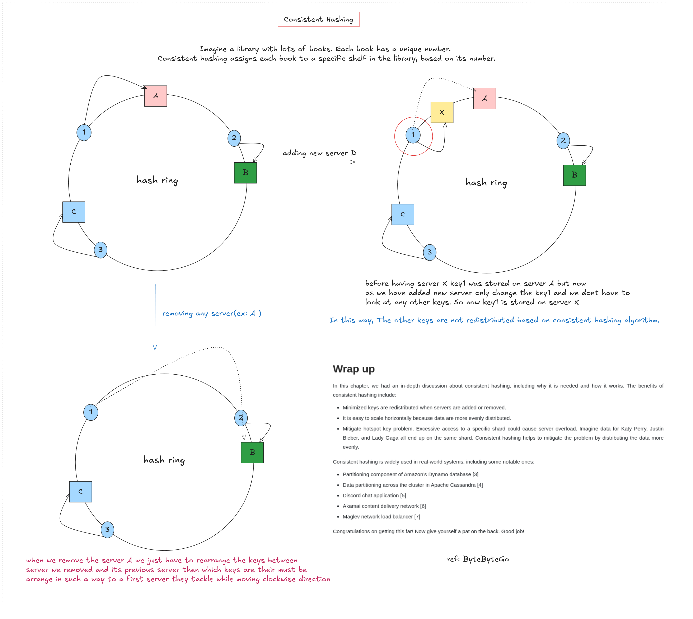
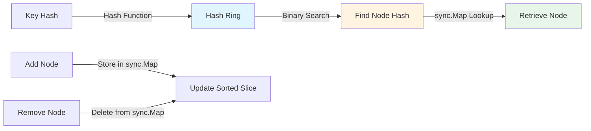

# Consistent Hashing Implementation

> A bare-bones implementation of consistent hashing in Go, providing efficient key-to-node mapping for distributed systems. This implementation allows you to dynamically add and remove nodes while minimizing key redistribution.



## Overview

Consistent hashing is a distributed hashing scheme that maps keys to nodes in a hash ring. When a node is added or removed, only a small subset of keys need to be remapped, making it ideal for distributed caching, load balancing, and database sharding.

## How It Works

-> The hash ring is a circular space where both nodes and keys are hashed and placed. Each key is assigned to the first node encountered when moving clockwise from the key's position. This ensures that when nodes are added or removed, only keys between the affected nodes need to be redistributed.

-> The implementation uses Go's built-in `sync.Map` as a thread-safe hash table to store nodes keyed by their hash values. `sync.Map` is chosen over a regular map with mutex locking because it provides optimized concurrent read performance when there are many readers and few writers, which is the typical access pattern in distributed systems. The map stores nodes with their hash values as keys, allowing O(1) node retrieval after binary search identifies the target hash.

-> A sorted slice of node hash values (`sortedKeyOfNodes`) is maintained alongside the map to enable efficient O(log n) binary search for finding the appropriate node. When a key needs to be mapped, its hash is computed, binary search finds the first node hash greater than or equal to the key hash, and then the node is retrieved from `sync.Map` using that hash value.



## Current Limitation

**Problem: Non-Uniform Distribution**

This implementation has a critical limitation: it cannot guarantee uniform distribution of nodes across the hash ring. This can lead to:

- **Hotspots**: Some nodes receive significantly more keys than others
- **Uneven Load**: Imbalanced traffic distribution causing performance bottlenecks
- **Single Point of Failure**: If an overloaded node fails, the entire system may collapse
- **Inefficient Resource Usage**: Some nodes remain underutilized while others are overwhelmed

## Roadmap

### Planned Features:

- **Virtual Nodes (VNodes)**: Implement virtual node functionality to ensure uniform distribution. Each physical node will be represented by multiple virtual nodes on the hash ring, dramatically improving load balancing and reducing hotspots.

- **Data Redundancy and Replication**: Add support for maintaining replica nodes to solve data redundancy problems. Each master node will have configurable replica nodes positioned clockwise on the hash ring. Replicas will maintain synchronized copies of data from their master node. When a master node fails, the system will automatically promote the next available replica node in clockwise order to become the new master, ensuring high availability and data durability without manual intervention.

## Usage

```go
// Initialize hash ring
ring := hashring.HashRingInit()

// Add nodes
node1 := &MyNode{ID: "node1"}
ring.AddNode(node1)

// Get node for a key
node, err := ring.GetNode("my-key")

// Remove node
ring.RemoveNode(node1)
```

## Features

- Thread-safe operations with mutex locking
- Dynamic node addition and removal
- Efficient O(log n) key lookup using binary search
- Configurable hash functions
- Comprehensive unit test coverage with mock nodes

## Installation

```bash
go get github.com/atharvamhaske/chash/hash-ring
```

## Testing

```bash
go test -v ./hash-ring
```

